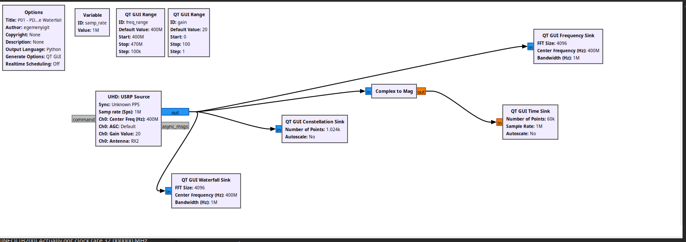
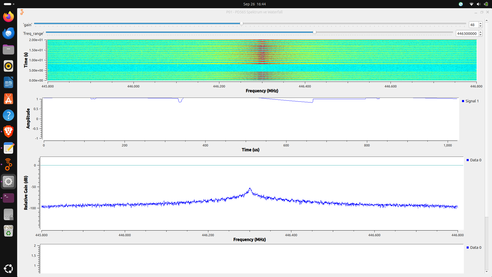
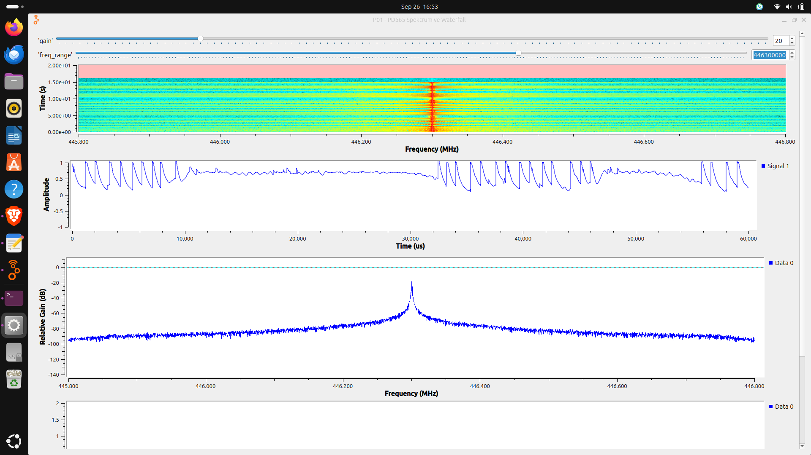
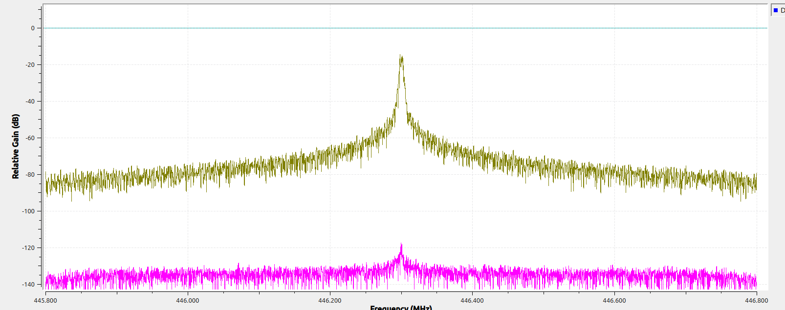
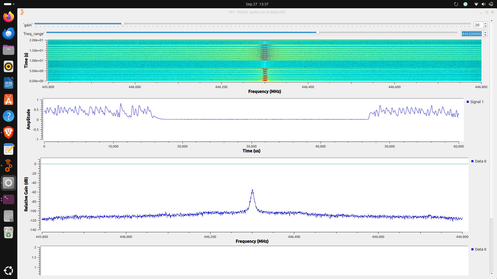

# Proje 01 — Spektrum + Waterfall

**Donanım:** USRP B210 + Hytera PD565 (DMR/analog el telsizi)
**Amaç:** PD565 sinyalini frekans (spektrum) ve zaman (waterfall + genlik) düzleminde
görmek. Henüz demodülasyon yok — sadece *"sinyal nerede, ne kadar geniş, ne kadar
güçlü?"* sorusu. Analog (CH A1) ve dijital/DMR (CH D1) modlarını karşılaştırmak.

> ⚠️ **Güvenlik:** PD565 UHF çıkışı ~4 W (36 dBm), B210 RX girişi ~ -15 dBm kaldırır.
> Telsizi **düşük güç** modunda, arada mesafe / **30 dB attenüatör** ile kullan.
> Asla doğrudan kablo bağlama. Yalnızca izinli kanallar.

---

## Flowgraph



**Sinyal zinciri:**

```
UHD USRP Source (samp_rate = 1 MHz, freq = 446.3 MHz, gain = 20 dB, ant = RX2)
   |-> QT GUI Frequency Sink   (complex, FFT 4096)   -> spektrum
   |-> QT GUI Waterfall Sink   (complex, FFT 4096)   -> zaman icinde spektrum
   +-> Complex to Mag -> QT GUI Time Sink (60k nokta = 60 ms) -> |IQ| zarfi
```

- **samp_rate = 1 MHz** -> görülebilen bant ±500 kHz. 12.5 kHz'lik kanal rahat sığar.
- **FFT 4096** -> RBW = 1e6/4096 ≈ **244 Hz/bin** (frekans çözünürlüğü).
- **Time Sink 60 ms** -> DMR'ın 60 ms'lik TDMA çerçevesini tam gösterir.

---

## Gözlemler

### 1. Gain ve doygunluk

Aynı sinyal, iki farklı gain:

| gain = 48 dB (doygunluk) | gain = 20 dB (doğru) |
|---|---|
|  |  |

- **gain = 48:** Sinyal ~200 kHz'lik geniş bir tümsek gibi ve |IQ| grafiği 1.0'a
  yapışık (kırpma). Bu **gerçek bant genişliği değil** — aşırı kazançtan doğan
  **doygunluk / spektral yayılma**.
- **gain = 20:** Tümsek daralıp **gerçek dar tepeye** (~12.5 kHz) dönüşüyor,
  |IQ| grafiği tabana iniyor.
- **Ders:** Doğru gain = doygunluğa girmeden gürültüyü ADC tabanından yukarı
  çıkaran değer. Gain **SNR'ı artırmaz** (sinyal + gürültü birlikte yükselir).

### 2. DC ofset vs gerçek sinyal

B210 **direct-conversion (zero-IF)** bir alıcı -> merkezde (0 Hz) sabit bir **DC
ofset** tepesi olabilir; bu sinyal değildir. Ayırt etme:

- **PTT'yi bırak:** Gerçek sinyal kaybolur, DC ofset merkezde kalır.
- **Frekansı kaydır:** Gerçek sinyal kanalda kalır, DC ofset **her zaman ekranın
  ortasında** durur.

Bu projede tepe, PTT ile gelip gittiği için **gerçek sinyal** olarak doğrulandı.
Tam çözüm (offset tuning + Frequency Xlating) ileriki projelerde.

### 3. SNR, gürültü tabanı ve FFT işlem kazancı

Max Hold (zeytin) + Min Hold (pembe) izleri:



- **Frequency Sink sayısal değer yazmaz** — dB'ler eksenden gözle okunur.
- **Max Hold** tepe zarfını dondurur; analog FM'de sinyalin uğradığı tüm
  frekansları boyar -> geniş etek = işgal edilen bant zarfı.
- **Min Hold'u gürültü tabanı sanma** — gürültünün en dip anlarını yakalar,
  gerçek tabanı düşük gösterir. SNR için taban = canlı/max-hold gürültü seviyesi.
- ⚠️ **Ekranda okunan "SNR" gerçek SNR değil.** FFT, spektrumu 244 Hz'lik binlere
  böler; sinyal birkaç bine toplanır, gürültü tüm binlere yayılır -> tepe/taban
  farkı **FFT işlem kazancıyla şişer**. FFT 4096 -> 1024 yapınca taban ~6 dB
  yükselir, tepe sabit kalır -> ekran SNR'ı düşer (fiziksel değişim yok).
- **Gerçek SNR**, sinyal ve gürültüyü **aynı bant genişliğinde** ölçmeyi gerektirir
  -> Proje 03 (blokla sayısal ölçüm).

### 4. Analog (CH A1) vs DMR (CH D1)



| | Analog FM (A1) | DMR (D1) |
|---|---|---|
| **Time sink** | Sürekli **dolu**, kesintisiz zarf | **Kesik kesik** — ~30 ms açık / ~30 ms kapalı |
| **Spektrum** | Sesle **genişler/daralır** (FM sapması) | **Sabit** ~12.5 kHz (4FSK) |
| **Waterfall** | Sürekli bant | Kesik/benekli |
| **Mekanizma** | Sürekli dalga, bilgi frekansta | TDMA + 4 seviyeli semboller |

D1 görüntüsünde time sink'te sinyalin **~30 ms açılıp kapandığı** net görülüyor.
Bir DMR çerçevesi = **60 ms = 2 zaman dilimi (TDMA)**; telsiz tek dilimi kullanıyor.
Ölçülen kapalı boşluk ≈ 30 ms = DMR zaman dilimi süresi.

---

## Öğrenilen kavramlar

- IQ (karmaşık örnek), `samp_rate` = görülebilen bant, Nyquist
- FFT / RBW = `samp_rate / FFT`, **FFT işlem kazancı**
- Doygunluk; gain'in SNR'ı artırmadığı
- FM sabit zarflıdır — bilgi frekansta, genlikte değil
- Zero-IF **DC ofset**; **TDMA** (DMR 30 ms slot)
- **Ekran SNR'ı != gerçek SNR**

## Sonraki adımlar

- **Proje 02:** Tepenin merkezden ~20 kHz kayması -> **ppm frekans hatası** ölçümü
- **Proje 03:** SNR ve bant genişliğini bloklarla **sayısal** ölçmek
