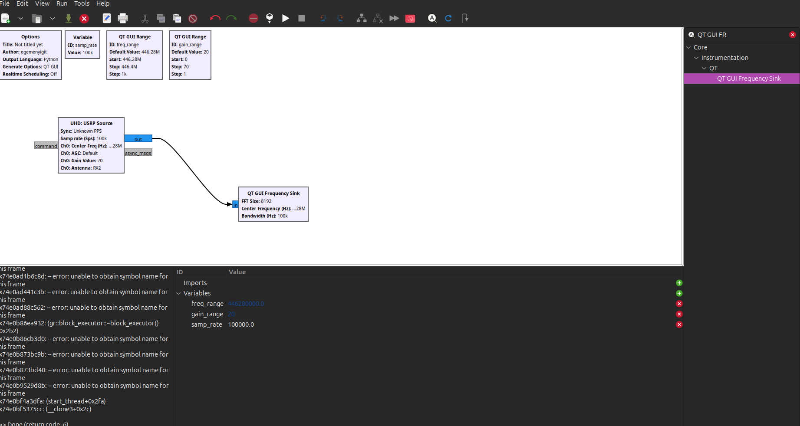
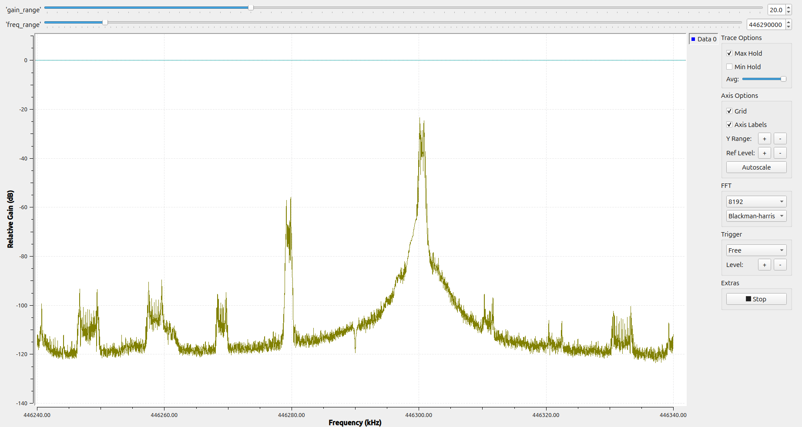
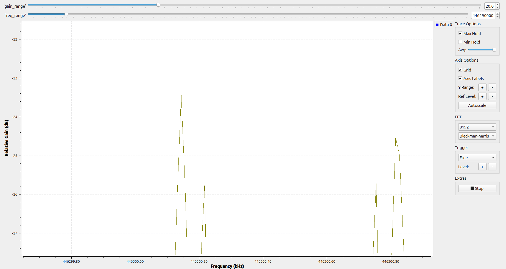

# Proje 02 — Frekans Hatası (ppm) Ölçümü

**Donanım:** USRP B210 + Hytera PD565
**Amaç:** PD565'in yaydığı taşıyıcının, nominal kanal frekansından ne kadar
saptığını (Δf) hassas ölçmek ve **ppm** cinsinden ifade etmek.

```
Δf  = f_ölçülen − f_nominal
ppm = Δf / f_nominal × 1.000.000
```

> Ölçülen sapma, **B210 + telsiz osilatörlerinin birleşik hatasıdır**. Kalibre bir
> referans (GPSDO) olmadan hangisinin ne kadar katkı verdiği ayrılamaz.

---

## Flowgraph



```
UHD USRP Source (samp_rate = 100 kHz, center = freq_range, gain = 20, RX2)
   └─► QT GUI Frequency Sink (complex, FFT 8192, Blackman-harris, grid)
```

**Proje 01'e göre 3 değişiklik — yeni blok yok:**
- **samp_rate = 100 kHz** (1 MHz değil) → ekran ±50 kHz, ince inceleme.
- **FFT = 8192** → RBW = 100000/8192 ≈ **12 Hz/bin** (Proje 01'de 244 Hz'di).
- **center = freq_range = kanal − 10 kHz** (offset tuning) → tek değişken hem
  USRP'yi hem sink eksenini sürer (eksen mislabel riski yok).

---

## Gözlemler

### 1. Offset tuning ve IQ image



Merkez (LO) 446.290 MHz'e ayarlandı. Ekranda **iki tepe**:

- **446.300 MHz (-24 dB) = GERÇEK SİNYAL** (baseband +10 kHz).
- **446.280 MHz (-57 dB) = IQ IMAGE** — B210'un IQ dengesizliğinin ürettiği
  ayna kopya (baseband −10 kHz). Merkez etrafında simetrik, ~**33 dB** aşağıda
  → bu B210'un **image rejection** değeri.

Offset tuning'in faydası: sinyal (+10 kHz), image (−10 kHz) ve DC/LO sızıntısı
(merkez) **ayrı ayrı** görünür. Sinyale tam ortadan basılsaydı üçü üst üste binerdi.

### 2. ppm ölçümü



Tepenin etrafına Hz mertebesinde zoom (eksende bölme = 200 Hz). Max Hold **birden
çok tepe** boyuyor → taşıyıcı ~±400 Hz **geziniyor** (sessiz PTT'de bile küçük
FM sapması / kısa süreli kararsızlık).

| Büyüklük | Değer |
|---|---|
| f_ölçülen (en güçlü tepe) | 446.30014 MHz |
| f_nominal (12.5 kHz rasterinden) | 446.30000 MHz |
| Δf | +140 Hz |
| **ppm** | **≈ 0.31 ppm** |

**Yorum:**
- 0.31 ppm, B210 TCXO speci (~±2 ppm) **altında** — çok iyi eşleşme.
- 446 MHz'de 0.31 ppm = 140 Hz → FM/DMR için **ihmal edilebilir**.
- Belirsizlik: taşıyıcı ±400 Hz gezindiği için gerçek değer ~**0.3 ppm ± birkaç
  yüz Hz**. Net söylem: **|hata| < ~1 ppm**.
- Nominal, CPS'e erişilemediği için **12.5 kHz kanal rasterinden** çıkarıldı
  (ölçülen 446.30014 → en yakın raster 446.30000).

---

## Öğrenilen kavramlar

- Offset tuning: sinyali DC'den ayırmak için merkezi bilerek kaydırmak
- **IQ image** ve image rejection (B210 ~33 dB)
- RBW = samp_rate / FFT; zoom için samp_rate ↓ veya fare ile rubber-band zoom
- ppm = frekans hatasının frekansa oranı × 1e6; **birleşik** referans hatası
- Taşıyıcı gezinmesi ölçüm hassasiyetinin **tabanını** belirler
- Ekranda okunan "kayma" ≠ fiziksel gerçek; RBW ve okuma hassasiyetine bağlı

## Sonraki adım

- **Proje 03:** SNR ve bant genişliğini bloklarla **sayısal** ölçmek
  (göz kararı yerine Number Sink + güç ölçüm zinciri).
