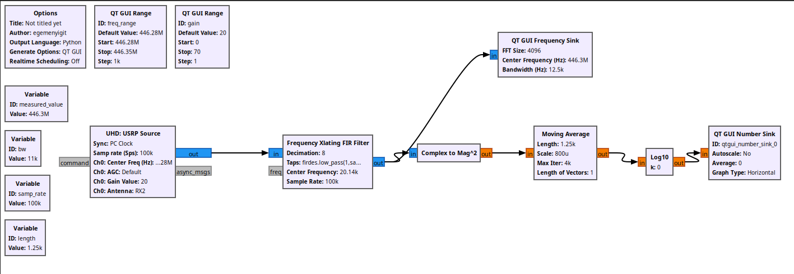
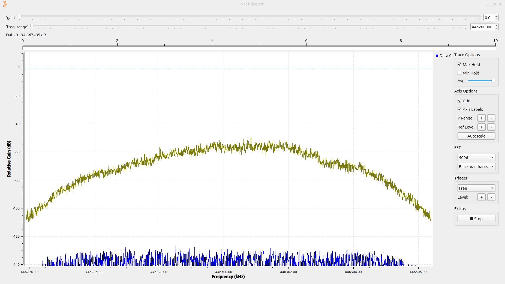
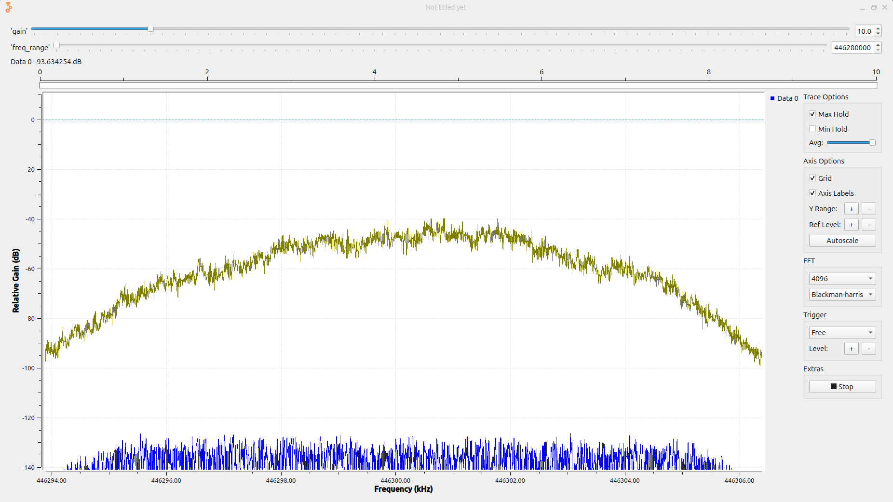
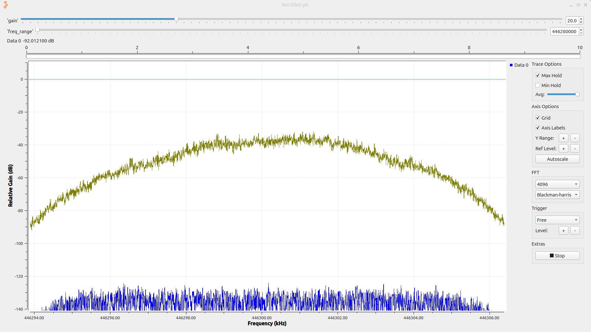

# Proje 03 — SNR'ın Sayısal Ölçümü

**Donanım:** USRP B210 + Hytera PD565
**Amaç:** Proje 01'de spektrumdan göz kararı okunan "SNR" FFT işlem kazancı
yüzünden şişikti ve RBW'ye bağlıydı. Bu projede sinyal ve gürültü gücünü
**aynı bant genişliğinde** ölçüp gerçek SNR'ı **rakamla** bulmak.

```
SNR (dB) = P(S+N) − P(N)        (sinyal baskınsa)
tam hali: Ps = P(S+N) − P(N)  (lineerde),  SNR = 10·log10(Ps / Pn)
```

---

## Flowgraph



```
USRP Source (100 kHz, center = freq_range)
  └► Frequency Xlating FIR Filter  (kaydır + süz + decim 8 → 12.5 kHz)
       ├► QT GUI Frequency Sink    (izole edilen kanalı görmek için)
       └► Complex to Mag^2 → Moving Average → Log10 → QT GUI Number Sink
```

### Parametre hesapları

| Blok | Parametre | Değer | Mantık |
|---|---|---|---|
| Değişken | `bw` | `2*(2.5+3)*1000` = 11 kHz | Carson: `2·(Δf + f_m)`, Δf = 2.5 kHz, f_m = 3 kHz. 12.5 kHz kanal aralığının içinde. |
| USRP | `center` | `freq_range` = 446.28 MHz | Offset tuning: sinyal +20 kHz'de, DC'den uzak ama ±50 kHz pencerenin içinde. |
| Xlating | `center_freq` | `measured_value − freq_range` ≈ 20.14 kHz | **Bağıl** kaydırma: sinyal − USRP merkezi. Merkez oynarsa kendiliğinden takip eder. |
| Xlating | `decim` | 8 → çıkış 12.5 kHz | Çıkış hızı > `bw` olmalı. 100e3/8 = 12.5 kHz > 11 kHz. |
| Xlating | `taps` | `firdes.low_pass(1, samp_rate, bw/2, bw*0.2)` | Kazanç 1 (gücü bozmasın), fs = **giriş** hızı (decim'den önce süzer), kesim = bw/2, geçiş = bw'nin %20'si. |
| Moving Average | `length` | 1250 | Çıkış hızı × süre = 12.5 kHz × 0.1 s. |
| Moving Average | `scale` | `1/length` | Blok toplar ve çarpar; ortalama için 1/N ile çarp. Değişkene bağlı, kaymaz. |
| Log10 | `n`, `k` | 10, 0 | Güç ölçüyoruz → `10·log10`. `k` log'dan **sonra** eklenen ofset, ham dBFS için 0. |
| Freq Sink | `fc`, `bw` | `measured_value`, `samp_rate/8` | Xlating sonrası akıştaki 0 Hz = sinyalin gerçek frekansı; hız = decim sonrası hız. |

---

## Gözlemler

### 1. İlk tarama: sinyal tam DC'nin üstünde (freq_range = 446.30014 MHz)

İlk ölçümlerde USRP merkezi yanlışlıkla **sinyalin tam üstüne** ayarlanmıştı
(offset tuning kapalı; Xlating kaydırması = 0). Değerler dBFS:

| Gain | P(N) | P(S+N) | SNR | Sinyal adımı |
|---|---|---|---|---|
| 0 | −88 | −26 | 62 dB | — |
| 10 | −86 | −18 | 68 dB | +8 dB |
| 20 | −85 | −8 | 77 dB | +10 dB |
| 30 | −82 | −3 | (79 dB) | +5 dB ⚠️ |
| 40 | −83 | −2 | (81 dB) | +1 dB ⚠️ |


- Spektrumun ortasındaki keskin **çentik**, B210'un otomatik **DC ofset
  düzeltmesinin** 0 Hz'i bastırması. Sinyal DC'ye oturunca taşıyıcının bir kısmı yeniyor.
- **Doygunluk eğrisi:** 0–20 arası sinyal doğrusal. 30'da **sıkışma** (+5 dB),
  40'ta 0 dBFS tavanında **doygunluk** (+1 dB). 30/40'taki SNR'lar güvenilmez.

### 2. Offset tuning ile tekrar (freq_range = 446.28 MHz, sinyal +20 kHz)

| Gain | P(N) | P(S+N) | SNR | Sinyal adımı |
|---|---|---|---|---|
| 0 | −95 | −23 | **72 dB** | — |
| 10 | −93 | −14 | **79 dB** | +9 dB |
| 20 | −91 | −5 | **86 dB** | +9 dB |

| gain 0 | gain 10 | gain 20 |
|---|---|---|
|  |  |  |

Görseller PTT kapalıyken alındı (Number Sink = gürültü gücü). Zeytin **Max Hold**
izi, PTT açıkken biriken sinyali gösteriyor. **Ortada çentik yok.**

### 3. Karşılaştırma: DC'de vs offset'te

| Gain | P(S+N) DC → offset | P(N) DC → offset | SNR DC → offset |
|---|---|---|---|
| 0 | −26 → −23 | −88 → −95 | 62 → 72 dB |
| 10 | −18 → −14 | −86 → −93 | 68 → 79 dB |
| 20 | −8 → −5 | −85 → −91 | 77 → 86 dB |

- **Sinyal ~3–4 dB yükseldi:** DC düzeltmesi artık taşıyıcıyı yemiyor.
- **Gürültü ~6–7 dB düştü:** 0 Hz civarı alıcının en kirli bölgesi (LO sızıntısı,
  DC artığı, 1/f gürültüsü). Kanal oradan uzaklaşınca daha temiz bir tabana oturuyor.
- **SNR ~10 dB iyileşti**, sadece merkezi 20 kHz kaydırarak.
- **Ders:** Offset tuning sadece "DC tepesini görmemek" için değil, **ölçülebilir
  performans** için de şart.

### 4. Gain ve gürültü tabanı

- Sinyal gain'i doğrusal takip ediyor (her 10 dB'de ~9 dB).
- Gürültü gain'i zar zor takip ediyor (her 10 dB'de ~2 dB). Bu aralıkta gürültü
  tabanını **ADC / dijital taban** belirliyor, ön-uç gürültüsü değil. Bu yüzden
  SNR gain'le **artıyor**.
- **"Gain SNR'ı artırmaz"** kuralı yalnızca **ön-uç gürültüsü baskınsa** geçerli.
  Düşük gain'de ADC tabanı baskın ve gain düşürmek SNR kaybettiriyor.
- **Çalışma noktası:** Offset'te sinyal gain 20'de −5 dBFS, tavana yakın. Bu kurulum
  için güvenli aralık gain **~15–20**.
- Tekrarlanabilirlik ±1–2 dB. Telsizin yeri, yönü ve güç seviyesi sabit tutulmalı.

### 5. Proje 01 ile fark

Proje 01'de ekranda okunan tepe/taban farkı **bin başına** idi ve FFT boyutuyla
değişiyordu. Buradaki SNR **11 kHz'lik gerçek bant genişliğinde** ölçüldü ve FFT
boyutundan **bağımsız**. Güç değerleri kalibre değil (dBFS), ama SNR bir oran
olduğu için mutlak seviyeler sadeleşir.

---

## Öğrenilen kavramlar

- Kanal izolasyonu: **kaydır → süz → decimate** (Frequency Xlating FIR)
- Güç ölçüm zinciri: |x|² → ortalama → 10·log10
- Gerçek SNR = aynı bantta sinyal ve gürültü gücü
- dBFS ve doygunluk / sıkışma eğrisi
- ADC tabanı vs ön-uç gürültüsü → optimum gain
- GRC'de değişken bağlama (`scale = 1/length`, `center = measured − freq_range`)
- Bilimsel gösterim (`446.30014e6`) ile basamak hatalarından kaçınma
- **Offset tuning'in SNR'a etkisi:** DC civarından kaçmak ~10 dB kazandırdı

## Sonraki adım

- **Proje 04:** DC ofset / IQ dengesizliği — merkezde vs offset'te ayarlama
- (İsteğe bağlı) PTT kapalı iken gain 50–70: gürültünün gain'i takip etmeye başladığı nokta

---

## Kavramlar (İngilizce terimler)

> Önceki projelerdeki terimler için 01 ve 02'nin README'lerine bak. Bu projede yeni geçenler:

- **dBFS (dB relative to Full Scale):** ADC'nin tam ölçeğine (|x|² = 1) göre güç.
  0 dBFS tavan; tüm değerler 0 veya negatif.
- **Occupied bandwidth:** Sinyalin gerçekte kapladığı bant (ör. gücün %99'u).
- **Channel spacing:** Kanallar arası aralık (burada 12.5 kHz).
- **Carson's rule:** FM bant genişliği tahmini, `BW ≈ 2·(Δf + f_m)`.
- **Frequency Xlating FIR Filter:** Frekans kaydırma + FIR süzme + decimation'ı tek blokta yapar.
- **Taps:** FIR filtre katsayıları. `firdes.low_pass` ile üretilir.
- **Cutoff / transition width:** Filtrenin kesim frekansı / geçiş bölgesinin genişliği.
  Dar geçiş = keskin filtre = daha fazla tap.
- **Decimation:** Örnek hızını tam sayı oranla düşürme. Filtrelemeden sonra yapılır
  (aliasing'i önlemek için).
- **Baseband:** 0 Hz etrafına indirilmiş sinyal.
- **Moving Average:** Son N örneğin (ölçekli) toplamı. Ortalama için `scale = 1/N`.
- **Compression:** Doygunluğa yaklaşırken çıkışın girişle doğrusal artmayı bırakması.
- **ADC noise floor:** Dijitalleştiricinin kendi gürültü tabanı. Gain'den bağımsız.
- **Front-end noise:** Anten, LNA ve karıştırıcı kaynaklı analog gürültü. Gain'le birlikte büyür.
- **DC offset correction:** UHD'nin 0 Hz'deki sabit bileşeni otomatik bastırması.
  Sinyal DC'ye oturursa onun da bir kısmını yer (çentik).
- **1/f (flicker) noise:** Frekans düştükçe artan gürültü. Direct-conversion
  alıcılarda 0 Hz civarını kirletir.

---

## Formüller

### Güç ölçüm zinciri (|x|² → ortalama → 10·log10)

| Büyüklük | Formül | Bu projedeki değer |
|---|---|---|
| Anlık güç | `p[n] = |x[n]|² = I² + Q²` | Complex to Mag^2 |
| Ortalama güç | `P = (1/L) · Σ p[n]` (n = 0…L−1) | Moving Average, `scale = 1/L` |
| Ortalama süresi | `T = L / fs_çıkış` | 1250 / 12 500 = **0.1 s** |
| Moving Average uzunluğu | `L = fs_çıkış · T` | 12 500 × 0.1 = **1250** |
| Güç (dBFS) | `P_dBFS = 10·log10(P) + k` | Log10 bloğu `n = 10`, `k = 0`; 0 dBFS ⇔ `|x|² = 1` |
| dB → lineer | `P = 10^(P_dB / 10)` | −23 dBFS → 5.0·10⁻³ |
| Doygunluk payı (headroom) | `H = 0 − P(S+N)_dBFS` | gain 20, offset: 0 − (−5) = **5 dB** |

### SNR

| Büyüklük | Formül | Bu projedeki değer |
|---|---|---|
| Ölçülen toplam güç | `P(S+N) = Ps + Pn` (lineer toplanır, dB'de toplanmaz) | — |
| Sinyal gücü | `Ps = P(S+N) − Pn` (lineer) | — |
| SNR (tam) | `SNR_dB = 10·log10( Ps / Pn ) = 10·log10( 10^((P(S+N) − Pn)/10) − 1 )` | — |
| SNR (sinyal baskınsa) | `SNR_dB ≈ P(S+N)_dB − Pn_dB` | gain 0, offset: −23 − (−95) = **72 dB** |
| Yaklaşımın hatası | `ε = 10·log10(1 + 1/SNR_lin)` | 72 dB'de ≈ 10⁻⁷ dB (ihmal edilebilir) |
| Gain'e karşı sinyal adımı | `ΔPs = Ps_dB(g₂) − Ps_dB(g₁)` (ideal: `= g₂ − g₁`) | −14 − (−23) = **+9 dB** (10 dB gain için) |
| Doygunlukta sıkışma | `ΔPs < Δg` ⇒ sıkışma (compression) | gain 20→30: +5 dB (< 10 dB) |
| Yerleşim etkisi (DC → offset) | `ΔSNR = ΔP(S+N) − ΔPn` | (−23 − (−26)) − (−95 − (−88)) = 3 + 7 = **10 dB** |

### Bant genişliği ve ölçek dönüşümü

| Büyüklük | Formül | Bu projedeki değer |
|---|---|---|
| Carson bant genişliği | `bw = 2·(Δf + f_m)` | 2·(2.5 + 3) = **11 kHz** |
| Gürültü gücü yoğunluğu | `N₀_dB = Pn_dB − 10·log10(B)` | −91 − 10·log10(11 000) ≈ **−131.4 dBFS/Hz** |
| Farklı banda dönüştürme | `SNR_B₂ = SNR_B₁ + 10·log10(B₁ / B₂)` | 244 Hz bin → 11 kHz: `10·log10(11 000 / 244) ≈ 16.5 dB` (Proje 01'deki ekran SNR'ının şişme nedeni) |

### Frequency Xlating FIR Filter parametreleri

| Parametre | Formül | Bu projedeki değer |
|---|---|---|
| Kaydırma | `center_freq = f_sinyal − f_LO` | 446.30014e6 − 446.28e6 = **+20.14 kHz** |
| Decimation | `decim = fs / fs_çıkış` | 100e3 / 12.5e3 = **8** |
| Çıkış hızı koşulu | `fs_çıkış > bw` (aliasing olmasın) | 12.5 kHz > 11 kHz |
| Kesim frekansı | `f_cutoff = bw / 2` | **5.5 kHz** |
| Geçiş genişliği | `f_transition = 0.2 · bw` | **2.2 kHz** |
| Ölçüm penceresi koşulu | `|center_freq| + bw/2 < fs/2` | 20.14 + 5.5 = 25.6 kHz < 50 kHz |
