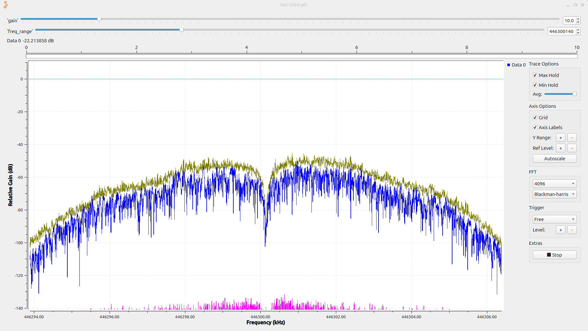

# Proje 03 — SNR'ın Sayısal Ölçümü

**Donanım:** USRP B205mini + Hytera PD565
**Amaç:** Proje 01'de spektrumdan göz kararı okunan "SNR" FFT işlem kazancı
yüzünden şişikti ve RBW'ye bağlıydı. Bu projede sinyal ve gürültü gücünü
**aynı bant genişliğinde** ölçüp gerçek SNR'ı **rakamla** bulmak.

```
SNR (dB) = P(S+N) − P(N)        (sinyal baskınsa)
tam hali: Ps = P(S+N) − P(N)  (lineerde),  SNR = 10·log10(Ps / Pn)
```

---

## Flowgraph


```
USRP Source (100 kHz, center = freq_range)
  └► Frequency Xlating FIR Filter  (kaydır + süz + decim 8 → 12.5 kHz)
       ├► QT GUI Frequency Sink    (izole edilen kanalı görmek için)
       └► Complex to Mag^2 → Moving Average → Log10 → QT GUI Number Sink
```

### Parametre hesapları

| Blok | Parametre | Değer | Mantık |
|---|---|---|---|
| Değişken | `bw` | `2*(2.5+3)*1000` = 11 kHz | Carson: `2·(Δf + f_m)`, Δf = 2.5 kHz, f_m = 3 kHz. 12.5 kHz kanal aralığının içinde. |
| USRP | `center` | `freq_range` = 446.28 MHz | Offset tuning: sinyal +20 kHz'de, DC'den uzak ama ±50 kHz pencerenin içinde. |
| Xlating | `center_freq` | `measured_value − freq_range` ≈ 20.14 kHz | **Bağıl** kaydırma: sinyal − USRP merkezi. Merkez oynarsa kendiliğinden takip eder. |
| Xlating | `decim` | 8 → çıkış 12.5 kHz | Çıkış hızı > `bw` olmalı. 100e3/8 = 12.5 kHz > 11 kHz. |
| Xlating | `taps` | `firdes.low_pass(1, samp_rate, bw/2, bw*0.2)` | Kazanç 1 (gücü bozmasın), fs = **giriş** hızı (decim'den önce süzer), kesim = bw/2, geçiş = bw'nin %20'si. |
| Moving Average | `length` | 1250 | Çıkış hızı × süre = 12.5 kHz × 0.1 s. |
| Moving Average | `scale` | `1/length` | Blok toplar ve çarpar; ortalama için 1/N ile çarp. Değişkene bağlı, kaymaz. |
| Log10 | `n`, `k` | 10, 0 | Güç ölçüyoruz → `10·log10`. `k` log'dan **sonra** eklenen ofset, ham dBFS için 0. |
| Freq Sink | `fc`, `bw` | `measured_value`, `samp_rate/8` | Xlating sonrası akıştaki 0 Hz = sinyalin gerçek frekansı; hız = decim sonrası hız. |

---

## Gözlemler

### 1. Gain taraması

Telsiz sessiz PTT (tek taşıyıcı), okumalar Number Sink'ten, değerler dBFS:

| Gain | P(N) (PTT kapalı) | P(S+N) (PTT açık) | SNR | Sinyal adımı |
|---|---|---|---|---|
| 0 | −88 | −26 | 62 dB | — |
| 10 | −86 | −18 | 68 dB | +8 dB |
| 20 | −85 | −8 | **77 dB** | +10 dB |
| 30 | −82 | −3 | (79 dB) | +5 dB ⚠️ |
| 40 | −83 | −2 | (81 dB) | +1 dB ⚠️ |

- **Sinyal, 0–20 arası doğrusal:** Her 10 dB gain → ~8–10 dB artış. 20'den sonra
  **sıkışma (compression)**, 40'ta 0 dBFS tavanına dayanıp **doygunluk**. 30 ve 40'taki
  SNR değerleri bu yüzden **güvenilmez** (parantez içinde).
- **Gürültü 40 dB gain boyunca sadece ~5 dB değişti** (−88 → −83). Bu aralıkta
  gürültü tabanını **ADC / dijital taban** belirliyor, ön-uç gürültüsü değil.
  Sabit tabana karşı sinyal büyüdüğü için SNR gain'le **artıyor**.
- **Ders:** "Gain SNR'ı artırmaz" kuralı yalnızca **ön-uç gürültüsü baskınsa** geçerli.
  Düşük gain'de ADC tabanı baskındır ve gain düşürmek SNR kaybettirir.
- **En iyi çalışma noktası:** gain ≈ 20 → sinyal −8 dBFS (doğrusal), SNR ≈ **77 dB**.
- Ölçüm tekrarlanabilirliği ±1–2 dB. Telsizin yeri, yönü ve güç seviyesi sabit
  tutulmalı. Yakın mesafede el hareketi bile birkaç dB değiştiriyor.

### 2. İzole edilen kanal ve DC düzeltme çentiği



- Xlating çıkışında sadece ~12 kHz'lik kanal görünüyor. Filtrenin şekli (kenarlarda
  düşüş) belli; kanal dışı her şey atılmış.
- Number Sink aynı anda sayısal değeri gösteriyor (üstte `Data 0 −22.2 dB`).
- Bu görüntü alınırken `freq_range = 446.30014 MHz`, yani USRP merkezi **tam sinyalin
  üstünde** (offset tuning kapalı). Ortadaki keskin **çentik**, B205mini'nin otomatik
  **DC ofset düzeltmesinin** 0 Hz'i bastırmasından kaynaklanıyor olabilir. Sinyal tam
  DC'ye oturunca merkezi kısmen yenebilir. Bu yüzden ölçümde offset tuning (446.28 MHz)
  tercih edildi.

### 3. Proje 01 ile fark

Proje 01'de ekranda okunan tepe/taban farkı **bin başına** idi ve FFT boyutuyla
değişiyordu. Buradaki SNR **11 kHz'lik gerçek bant genişliğinde** ölçüldü ve FFT
boyutundan **bağımsız**. Güç değerleri kalibre değil (dBFS), ama SNR bir oran
olduğu için mutlak seviyeler sadeleşir.

---

## Öğrenilen kavramlar

- Kanal izolasyonu: **kaydır → süz → decimate** (Frequency Xlating FIR)
- Güç ölçüm zinciri: |x|² → ortalama → 10·log10
- Gerçek SNR = aynı bantta sinyal ve gürültü gücü
- dBFS ve doygunluk / sıkışma eğrisi
- ADC tabanı vs ön-uç gürültüsü → optimum gain
- GRC'de değişken bağlama (`scale = 1/length`, `center = measured − freq_range`)
- Bilimsel gösterim (`446.30014e6`) ile basamak hatalarından kaçınma

## Sonraki adım

- **Proje 04:** DC ofset / IQ dengesizliği — merkezde vs offset'te ayarlama
- (İsteğe bağlı) PTT kapalı iken gain 50–70: gürültünün gain'i takip etmeye başladığı nokta

---

## Kavramlar (İngilizce terimler)

> Önceki projelerdeki terimler için 01 ve 02'nin README'lerine bak. Bu projede yeni geçenler:

- **dBFS (dB relative to Full Scale):** ADC'nin tam ölçeğine (|x|² = 1) göre güç.
  0 dBFS tavan; tüm değerler 0 veya negatif.
- **Occupied bandwidth:** Sinyalin gerçekte kapladığı bant (ör. gücün %99'u).
- **Channel spacing:** Kanallar arası aralık (burada 12.5 kHz).
- **Carson's rule:** FM bant genişliği tahmini, `BW ≈ 2·(Δf + f_m)`.
- **Frequency Xlating FIR Filter:** Frekans kaydırma + FIR süzme + decimation'ı tek blokta yapar.
- **Taps:** FIR filtre katsayıları. `firdes.low_pass` ile üretilir.
- **Cutoff / transition width:** Filtrenin kesim frekansı / geçiş bölgesinin genişliği.
  Dar geçiş = keskin filtre = daha fazla tap.
- **Decimation:** Örnek hızını tam sayı oranla düşürme. Filtrelemeden sonra yapılır
  (aliasing'i önlemek için).
- **Baseband:** 0 Hz etrafına indirilmiş sinyal.
- **Moving Average:** Son N örneğin (ölçekli) toplamı. Ortalama için `scale = 1/N`.
- **Compression:** Doygunluğa yaklaşırken çıkışın girişle doğrusal artmayı bırakması.
- **ADC noise floor:** Dijitalleştiricinin kendi gürültü tabanı. Gain'den bağımsız.
- **Front-end noise:** Anten, LNA ve karıştırıcı kaynaklı analog gürültü. Gain'le birlikte büyür.
- **DC offset correction:** UHD'nin 0 Hz'deki sabit bileşeni otomatik bastırması.
