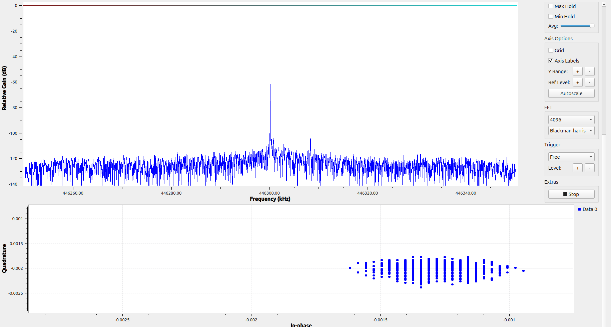
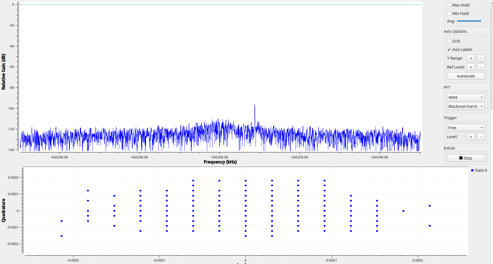
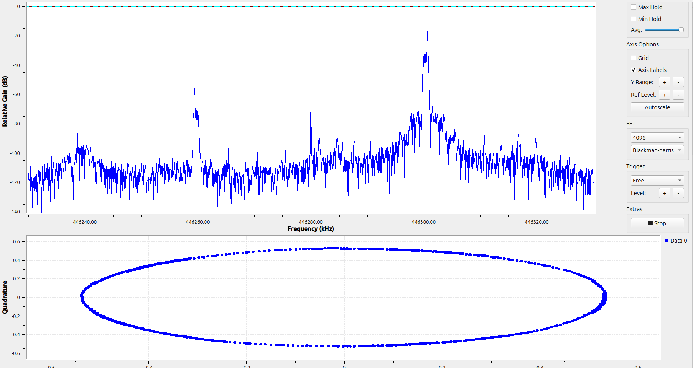
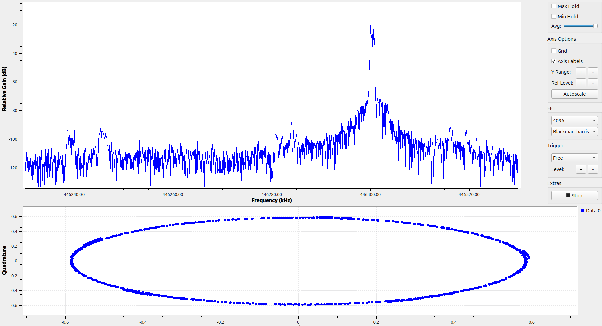
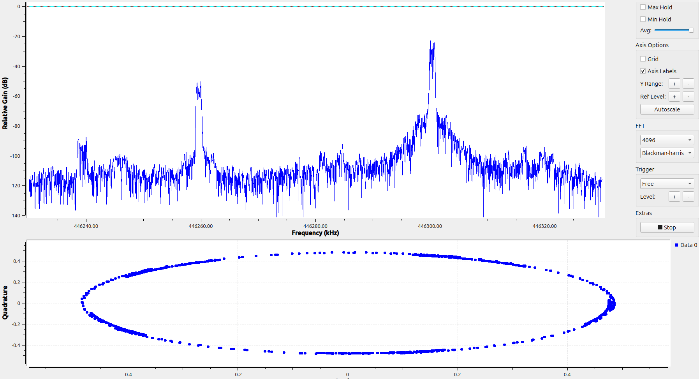
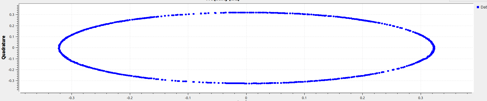
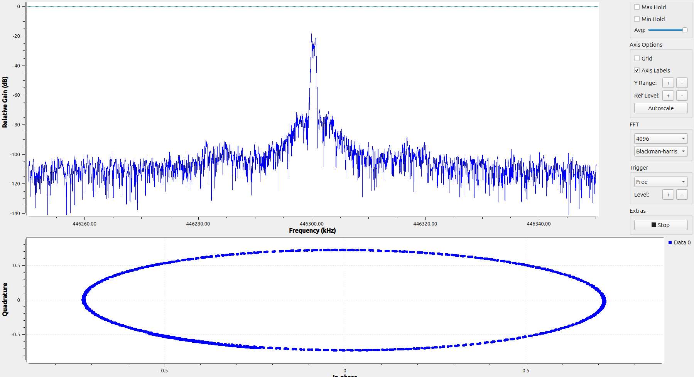
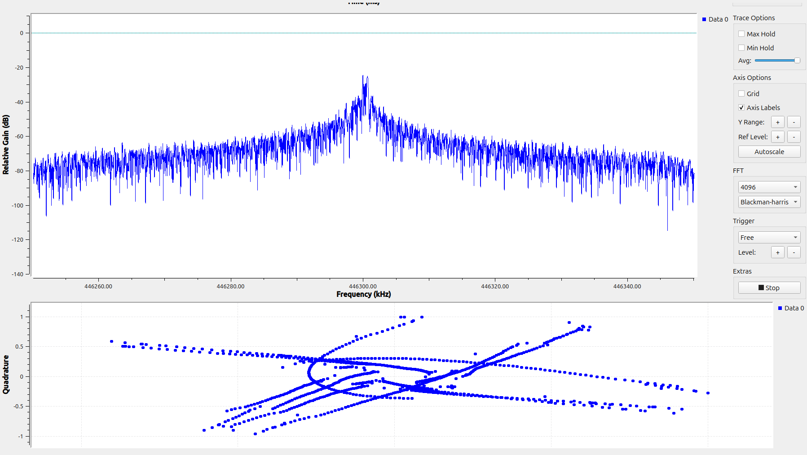

# Proje 04 — DC Ofset ve IQ Dengesizliği

**Donanım:** USRP B210 + Hytera PD565
**Amaç:** Proje 02 ve 03'te kazara karşılaşılan iki alıcı kusurunu — merkezdeki **DC
ofset** ve aynadaki **IQ image** — bilerek üretmek, ölçmek ve UHD'nin otomatik
düzeltmelerini açıp kapatarak **ne kazandırdıklarını dB olarak** görmek.

> **Tek cümlelik sonuç:** Düzeltmeler açık ve **oturmuşken** DC tepesi gürültüye
> gömülür ve image ~39 dB'den ≳95 dB'ye bastırılır. Ama IQ düzeltmesi her yeniden
> ayarlamada **sıfırdan oturur** (~20 s), DC düzeltmesi de **DC'ye konan sinyali bozar**.

---

## Görseller nasıl okunur?

```
img/
├── a1_kapali/   analog kanal (CH A1), DC + IQ düzeltmesi KAPALI (disabled)
├── a1_acik/     analog kanal (CH A1), DC + IQ düzeltmesi AÇIK   (auto)
└── d1_kapali/   DMR kanalı  (CH D1), DC + IQ düzeltmesi KAPALI (disabled)
```

Dosya adı = `NN_<merkez>_<ptt>_<grafik>.png`

| Parça | Anlamı |
|---|---|
| `dc` | USRP merkezi = sinyal frekansı (446.30014 MHz) → sinyal **0 Hz'de** |
| `offset` | USRP merkezi = 446.28 MHz → sinyal **+20 kHz'de**, image −20 kHz'de |
| `ptt-kapali` / `ptt-acik` | Telsiz susuyor (sadece gürültü + kusurlar) / yayında |
| `zaman` | Time Sink (I = mavi, Q = kırmızı) |
| `spektrum-const` | Üstte spektrum, altta constellation (IQ düzlemi) |

Aynı numara üç klasörde **aynı durumu** gösterir (ör. `08` = offset, PTT açık,
spektrum + constellation). Klasörleri yan yana açıp karşılaştırabilirsin.

---

## Flowgraph

`project_04.grc`

```
UHD: USRP Source  (samp_rate = 100 kHz, gain = 20, center = freq_range,
                   DC offset = disabled | auto, IQ balance = disabled | auto)
   ├─► QT GUI Frequency Sink      (complex, FFT 4096, fc = freq_range)
   ├─► QT GUI Time Sink           (complex → I ve Q ayrı çizgiler)
   └─► QT GUI Constellation Sink  (I yatay, Q dikey)
```

- `freq_range` kaydırıcısı **446.28 – 446.35 MHz** → hem `dc` (446.30014) hem
  `offset` (446.28) konumuna gidilebiliyor.
- Düzeltme ayarları USRP Source'taki **DC Offset Mode** ve **IQ Balance Mode**.
  `auto` seçilince üretilen `.py`'de `set_auto_dc_offset(True)` /
  `set_auto_iq_balance(True)` görünür. **`default` ≠ `auto`:** `default` hiçbir komut
  göndermez, cihaz kendi varsayılanıyla kalır.
- Hep **gain 20**, telsiz aynı yerde.

---

## Gözlemler

### 1. DC ofset zaman domeninde de görünür

| Düzeltme kapalı | Düzeltme açık |
|---|---|
|  |  |

- **Kapalı:** PTT kapalıyken (sinyal yok) I ve Q gürültüsü 0 etrafında değil,
  sabit bir değer etrafında dalgalanıyor. Constellation'da gürültü bulutu
  **orijinden kaymış**: ≈ −0.0013 − j0.0020 → |DC| ≈ 0.0024 → **≈ −52 dBFS**.
  Spektrumda merkezde **≈ −62 dB**'lik tepe.
- **Açık:** Bulut orijinde (±0.0001–0.0002, sadece gürültü), spektrumda DC tepesi **yok**.
- Zaman domeninde görmek için Y eksenini **çok yakınlaştırmak** gerekti
  (`a1_kapali/01`, `a1_acik/01`). Sinyalin yanında (genlik ~0.5) bu kayma
  binde birler mertebesinde → gözle seçilmez. **Spektrumda ise tüm DC enerjisi
  tek bir bin'e toplandığı için** gürültünün üstünde keskin bir tepe olarak öne
  çıkar (Proje 01'deki işlem kazancı).
- **Bonus:** `d1_kapali/06`'da constellation bulutu düzgün **sütunlar** halinde.
  Sinyal o kadar küçük ki (~0.0005), USB üzerinden gelen 16 bit verinin
  **kuantizasyon adımları** (1/32768 ≈ 3·10⁻⁵) görünür hale geliyor.

### 2. DC ofset sabit değil

| Ölçüm | Merkez dc (446.30014) | Merkez offset (446.28) |
|---|---|---|
| Sabah, D1 | +0.0021 + j0.0008 (−53 dBFS), tepe −62 dB | −0.00045 − j0.00035 (−65 dBFS), tepe −77 dB |
| Öğleden sonra, A1 | −0.0013 − j0.0020 (−52 dBFS), tepe −62 dB | −0.0004 + j0.0003 (−66 dBFS), tepe −76 dB |

- **Büyüklük** tekrarlanabilir (±1 dB), ama **yön (işaret)** değişiyor.
- Time Sink ile Constellation okumaları arasında bile ~0.0005'lik fark var.
- *Hipotez:* B210'un RF çipi her yeniden ayarlamada kendi kalibrasyonunu yapıyor ve
  geriye kalan artık her seferinde farklı. UHD'nin DC düzeltmesini bir kere değil
  **sürekli (tracking)** yapmasının sebebi bu.

### 3. IQ image ve image rejection

| Düzeltme kapalı | Düzeltme açık (oturmuş) |
|---|---|
|  |  |

Merkez 446.28 → sinyal **446.300**'de (+20 kHz), image **446.260**'ta (−20 kHz):

| | Sinyal | Image | **IRR** (image rejection) |
|---|---|---|---|
| Kapalı (A1) | ≈ −18 dB | ≈ −57 dB | **≈ 39 dB** |
| Kapalı (D1, `d1_kapali/08`) | ≈ −38 dB | ≈ −78 dB | **≈ 40 dB** |
| Açık, oturmuş (A1) | ≈ −21 dB | görünmüyor (< −115) | **≳ 95 dB** |

IRR = sinyal tepesi − image tepesi. Analog ve DMR'da kapalı değer aynı çıktı →
bu bir **alıcı özelliği**, sinyal türüne bağlı değil.

### 4. IQ düzeltmesi zamanla oturuyor

| Yeniden ayarlamadan hemen sonra | ~20 s sonra |
|---|---|
|  |  |

`09`'da düzeltme **açık** olmasına rağmen image ≈ −52 dB (IRR ≈ 30 dB) — kapalıdan
bile kötü. Test: PTT açık, kaydırıcıyı oynatıp 446.28'e geri getir, constellation'daki
**Q/I genlik oranını** eksen değerlerinden oku.

```
IRR ≈ 20·log10( (1+g) / (1−g) )      g = Q/I genlik oranı (faz hatası 0 varsayıldı)
```

| Süre | Q/I | Genlik hatası | ≈ IRR |
|---|---|---|---|
| 0 s | 0.90 | %10 | ~26 dB |
| 5 s | 0.97 | %3 | ~36 dB |
| 10 s | 0.98 | %2 | ~40 dB |
| 20 s | 0.99 | %1 | ≥ ~46 dB |

- 0 s tahmini (~26 dB), spektrumdan okunan ~30 dB ile **uyumlu** → iki yöntem tutarlı.
- Düzeltme her yeniden ayarlamada **sıfırdan başlıyor**, birkaç saniyede büyük kısmı,
  ~20 s'de neredeyse tamamı oturuyor. Sonrasında spektrumda image tamamen kayboluyor.
- **Ders:** Düzeltme açıkken ölçüm, düzeltme **oturduktan sonra** alınmalı.

### 5. Constellation'ın sınırı

Bütün çemberler (kapalı da açık da) gözle **kusursuz** görünüyor:
`a1_kapali/04` I ≈ ±0.72, Q ≈ ±0.73 · `a1_kapali/08` ±0.54 · `a1_acik/08` ±0.59.

- 39 dB IRR ≈ sadece **%2 genlik** (ya da ~1.3° faz) hatası → şekle bakarak seçilmez.
- Eksen değerlerini **sayı olarak** okuyunca %1–2 yakalanabiliyor (Gözlem 4),
  yani constellation ~45 dB'ye kadar ölçer. **95 dB gibi farkları sadece spektrum gösterir.**
- ⚠️ Panel çok geniş olduğu için çemberler ekranda **basık elips** gibi görünüyor →
  elipsi gözle değil, **eksen değerlerinden** yargıla.

### 6. Otomatik DC düzeltmesi açıkken sinyali DC'ye koyma ❗

| Düzeltme kapalı, sinyal DC'de | Düzeltme açık, sinyal DC'de |
|---|---|
|  |  |

- **Kapalı:** Temiz bir çember. Taşıyıcı LO'ya göre ~220 Hz uzakta, fazör yavaşça
  dönüyor (`a1_kapali/03`: periyot ~4.5 ms). Çemberin dönüş hızı = **kalan frekans
  hatası** (Proje 02'de 140 Hz ölçülmüştü → ~0.2 ppm kayma).
- **Açık:** Gürültü tabanı −120'den **−75**'e çıkmış, constellation çizgilerden
  oluşan bir karmaşa. `a1_acik/03`'te PTT anında sıçrama ve asimetrik salınım
  (I +0.35/−0.41, Q +0.39/−0.23).
- **Neden:** DC düzeltmesi sinyalin uzun süreli ortalamasını "kusur" sayıp çıkarır.
  DC'ye birkaç yüz Hz uzakta yavaş dönen taşıyıcının kısa süreli ortalaması sıfır
  değildir → takip döngüsü **sinyalin kendisini** çıkarmaya çalışır.
- **Doğrulama:** Merkez 446.3e6'dayken sadece DC düzeltmesi `disabled` yapılınca
  constellation düzgün çembere döndü.
- Proje 03'teki spektrum **çentiği** ile aynı olgu. → **Offset tuning, düzeltmenin
  sinyale dokunmaması için şart.**

### 7. DMR (D1) ve diğer ayrıntılar

- **TDMA:** `d1_kapali/03`'te burst ~5.8 ms'de bitiyor, `07`'de ~2.3 ms'de başlıyor.
  `08`'de constellation'da çember + ortada küme (boş zaman dilimlerindeki örnekler).
- **Dış sinyal:** PTT kapalıyken **446.309 MHz**'de küçük bir tepe var. Merkez
  446.30'dan 446.28'e kaydırılınca **mutlak frekansta yerinde kaldı** → LO kaynaklı
  değil (DC/image/spur merkezle birlikte hareket ederdi), **havadan gelen gerçek bir
  sinyal**. "Merkezi oynat, ne hareket ediyor bak" = iç/dış kaynak ayrımının standart yolu.
- **Doygunluğa yakın:** `a1_kapali/07`'de genlik ~0.8 (≈ −2 dBFS). `08`'de +40 kHz
  (446.320, tonun 2. harmoniği) ve −40 kHz (446.240, onun image'ı) civarında küçük
  tepeler → 2. derece bozulma.
- **Örnekleme yanılsaması:** Offset'te 100 kHz / 20 kHz = döngü başına **5 örnek**.
  Örnekler her döngüde tepeye denk gelmediği için time sink zarfı dalgalanıyormuş
  gibi görünür (`a1_kapali/07`) — gerçek bir genlik değişimi değil.

> Not: D1'in `01`–`02` (dc, PTT kapalı) görselleri kayboldu; değerleri Gözlem 2
> tablosunda (sabah satırı) korunuyor.

---

## Sonuç tablosu (A1, gain 20)

| | DC tepesi (dc / offset) | \|DC\| (dc / offset) | IRR |
|---|---|---|---|
| Düzeltme **kapalı** | −62 / −76 dB | −52 / −66 dBFS | ~39 dB |
| Düzeltme **açık**, oturmuş | gürültüde | ≈ 0 | ≳ 95 dB |
| Düzeltme **açık**, yeni ayarlanmış | gürültüde | ≈ 0 | ~26–30 dB → ~20 s'de oturur |

### Proje 02'deki 33 dB bulmacası
Proje 02'de (ayar `default`) image ~33 dB ölçülmüştü. Düzeltme gerçekten açık ve
oturmuş olsaydı image görünmezdi. Olası açıklamalar: (a) `default` IQ düzeltmesini
etkin şekilde açmıyor, (b) ölçüm düzeltme oturmadan alındı. Her iki durumda da 33 dB,
B210'un **düzeltilmiş** performansı değil, **düzeltmesiz** performansına yakın.

---

## Öğrenilen kavramlar

- DC ofset ve IQ dengesizliği: zero-IF alıcının iki temel kusuru
- Aynı kusurun üç görünümü: zaman (kayma), IQ düzlemi (merkez kayması / elips), spektrum (tepe / image)
- Küçük kusurlar spektrumda, büyükler zamanda/IQ'da daha kolay görülür
- Otomatik düzeltmeler **takip (tracking)** eder: zamanla oturur, yeniden ayarlamada sıfırlanır
- DC düzeltmesi + DC'deki sinyal = bozulma → offset tuning
- Constellation dönüş hızı = kalan frekans hatası
- İç/dış kaynak ayrımı: merkezi kaydır, hareket edeni bul
- Ölçüm disiplini: aynı oturum, aynı ayar, tek değişken; görselleri hemen adlandır

## Sonraki adım

- **Proje 05:** Frequency Xlating FIR ile kanal seçme + decimation (Proje 03'te
  kullanıldı, şimdi kendi başına derinlemesine)
- (İsteğe bağlı) `default` ayarıyla image'a bakıp Proje 02 bulmacasını kesinleştirmek
- (İsteğe bağlı) Proje 03 güç zinciriyle image'ı dar filtrede sayısal ölçmek

---

## Kavramlar (İngilizce terimler)

> Önceki projelerdeki terimler için 01–03'ün README'lerine bak. Bu projede yeni geçenler:

- **DC offset mode / IQ balance mode:** USRP Source'ta otomatik düzeltmelerin ayarı
  (`default` / `auto` / `disabled` / `manual`).
- **IQ imbalance (IQ dengesizliği):** I ve Q kollarının genlik veya 90° faz farkının
  tam tutmaması. IQ düzleminde çemberi elipse, spektrumda image'a dönüştürür.
- **Image rejection ratio (IRR):** Sinyal ile aynasındaki image arasındaki dB fark.
- **Amplitude / phase imbalance:** IQ dengesizliğinin genlik (g = Q/I) ve faz (φ) bileşenleri.
- **Tracking (takip):** Düzeltmenin sürekli güncellenmesi. Bir **yakınsama
  (convergence)** süresi vardır.
- **LO leakage:** Yerel osilatörün sinyal yoluna sızması; DC ofsetin ana kaynağı.
- **Constellation (IQ plot):** I yatay, Q dikey eksende örneklerin dağılımı.
- **Phasor (fazör):** IQ düzleminde dönen vektör; dönüş hızı = frekans.
- **Quantization step (LSB):** Sayısal verinin en küçük adımı (sc16 için 1/32768).
- **Harmonic distortion:** Doygunluğa yakın çalışmada tonun katlarında oluşan bozulma.
- **Retune:** Merkez frekansın yeniden ayarlanması; kalibrasyon/takip sıfırlanabilir.
